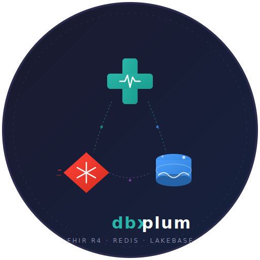

# dbxplum

<p align="center">
  
</p>

**Medplum FHIR R4 server running on Databricks Apps with Lakebase (PostgreSQL) and co-located Redis.**

A production-ready deployment of [Medplum](https://www.medplum.com/) on the Databricks platform, using:

- **Databricks Apps** — managed container runtime (LARGE compute)
- **Lakebase Autoscaling** — PostgreSQL-compatible database with auto-injected connection env vars
- **Co-located Redis** — compiled from source at deploy time, running in-process
- **Databricks Asset Bundles (DABs)** — infrastructure-as-code deployment

## Architecture

```
┌──────────────────────────────────────────────────┐
│            Databricks App (LARGE)                 │
│                                                   │
│  ┌───────────┐   ┌──────────┐   ┌────────────┐  │
│  │  Frontend  │   │  Medplum │   │   Redis    │  │
│  │   Proxy    │──▶│  Server  │──▶│  (local)   │  │
│  │  :8000     │   │  :8001   │   │  :6379     │  │
│  └───────────┘   └────┬─────┘   └────────────┘  │
│                        │                          │
└────────────────────────┼──────────────────────────┘
                         │ OAuth JWT (auto-refresh)
                         ▼
              ┌──────────────────────┐
              │   Lakebase (PG)      │
              │  Autoscaling Branch  │
              └──────────────────────┘
```

## Key Features

- **No hardcoded secrets** — Redis password via `valueFrom` (Databricks secret scope); PG auth via OAuth client_credentials flow
- **Auto token refresh** — OAuth JWT refreshes 5 min before expiry (~every 55 min), so PG connections never go stale
- **Cookie-based auth relay** — Medplum frontend auth works through Databricks gateway via `HttpOnly` session cookies
- **Single-app deployment** — server, Redis, and frontend all run in one LARGE app for simplicity
- **FHIR R4 compliant** — full Medplum server with all resource types, search parameters, and subscriptions

## Prerequisites

1. [Databricks CLI](https://docs.databricks.com/dev-tools/cli/index.html) (v0.200+)
2. A Databricks workspace with Apps and Lakebase enabled
3. A CLI profile configured (e.g., `fevm-medplum`)

## Setup

### 1. Create Lakebase project

```bash
databricks lakebase projects create --name medplum --profile <your-profile>
databricks lakebase branches create --project medplum --name production --profile <your-profile>
```

### 2. Create secret scope

```bash
databricks secrets create-scope medplum-secrets --profile <your-profile>
databricks secrets put-secret medplum-secrets redis-password --string-value "<your-redis-password>" --profile <your-profile>
```

### 3. Configure bundle target

Edit `databricks.yml` — update the `workspace.host` and `workspace.profile` for your environment:

```yaml
targets:
  dev:
    default: true
    workspace:
      host: https://your-workspace.cloud.databricks.com
      profile: your-profile
```

### 4. Deploy

```bash
databricks bundle deploy
databricks apps start medplum-server --profile <your-profile>
```

### 5. Grant schema permissions (first deploy only)

After the first deploy, the app's service principal needs CREATE permission on the `public` schema:

```bash
echo 'GRANT ALL ON SCHEMA public TO "<SP-CLIENT-ID>";' | databricks psql --autoscaling --profile <your-profile>
```

The SP client ID is visible in the app's environment as `DATABRICKS_CLIENT_ID`.

## Project Structure

```
dbxplum/
├── databricks.yml              # DABs bundle config
├── resources/
│   └── apps.yml                # App resource definition (compute, DB, secrets)
└── apps/medplum-server/
    ├── app.yaml                # App runtime config (command, env vars)
    ├── start.js                # Main entrypoint (OAuth, Redis, Medplum, proxy)
    ├── package.json            # Node.js deps
    ├── scripts/build.js        # Build script (compiles Redis from source)
    ├── server/                 # Medplum server bundle (pre-built)
    ├── public/                 # Medplum frontend (pre-built React SPA)
    └── logo.svg                # App logo
```

## How It Works

### Authentication Flow

1. **PG password**: At startup, `start.js` fetches an OAuth JWT via client_credentials grant using the auto-injected `DATABRICKS_CLIENT_ID` / `DATABRICKS_CLIENT_SECRET` env vars. This JWT is used as the PostgreSQL password.

2. **Token refresh**: A background loop refreshes the token 5 minutes before expiry, updating `process.env.PGPASSWORD` and the config file so new PG connections always use a valid token.

3. **Frontend auth**: The Databricks gateway replaces the browser's `Authorization` header with its own. To work around this, the proxy stores Medplum's access token in an `HttpOnly` cookie and injects it back on each request.

### Lakebase Connection

Lakebase auto-injects these env vars when a `postgres` resource is bound:

| Env Var | Example |
|---------|---------|
| `PGHOST` | `ep-morning-haze-xxxx.database.us-east-1.cloud.databricks.com` |
| `PGDATABASE` | `databricks_postgres` |
| `PGPORT` | `5432` |
| `PGUSER` | `<service-principal-client-id>` |
| `PGSSLMODE` | `require` |
| `PGAPPNAME` | `medplum-server` |

No connection strings or passwords in config files — everything is runtime-injected.

## Development

### Redeploy after code changes

```bash
databricks bundle deploy
databricks apps deploy medplum-server \
  --source-code-path /Workspace/Users/<you>/.bundle/medplum-fhir-platform/dev/files/apps/medplum-server \
  --profile <your-profile>
```

### View logs

```bash
databricks apps logs medplum-server --profile <your-profile>
```

### Connect to database

```bash
databricks psql --autoscaling --profile <your-profile>
```

## License

MIT
