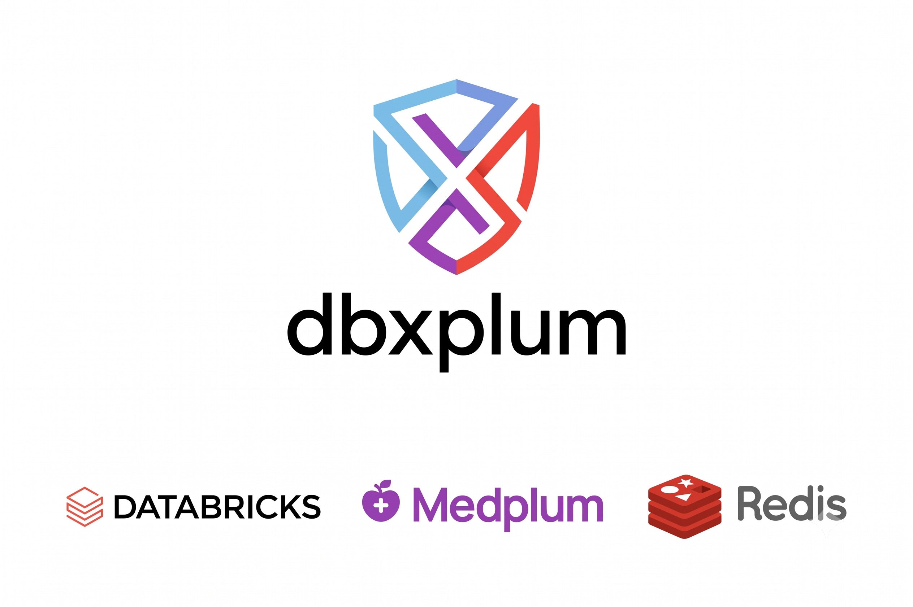

# dbxplum

<p align="center">
  
</p>

**Medplum FHIR R4 server running on Databricks Apps with Lakebase (PostgreSQL) and co-located Redis.**

A production-ready deployment of [Medplum](https://www.medplum.com/) on the Databricks platform, using:

- **Databricks Apps** — managed container runtime (LARGE compute)
- **Lakebase** — PostgreSQL-compatible database, provisioned by the bundle
- **Co-located Redis** — compiled from source at deploy time, running in-process
- **Databricks Asset Bundles (DABs)** — infrastructure-as-code deployment

## Architecture

```
┌──────────────────────────────────────────────────┐
│            Databricks App (LARGE)                │
│                                                  │
│  ┌────────────┐   ┌──────────┐   ┌────────────┐  │
│  │  Frontend  │   │  Medplum │   │   Redis    │  │
│  │   Proxy    │──▶│  Server  │──▶│  (local)   │  │
│  │  :8000     │   │  :8001   │   │  :6379     │  │
│  └────────────┘   └────┬─────┘   └────────────┘  │
│                        │                         │
└────────────────────────┼─────────────────────────┘
                         │ OAuth JWT (auto-refresh)
                         ▼
              ┌──────────────────────┐
              │   Lakebase (PG)      │
              │  Autoscaling Branch  │
              └──────────────────────┘
```

## Key Features

- **One-command deploy** — `./deploy.sh` handles everything: infrastructure, permissions, and app startup
- **No hardcoded secrets** — Redis password via Databricks secret scope; PG auth via OAuth client_credentials flow
- **Auto token refresh** — OAuth JWT refreshes 5 min before expiry (~every 55 min), so PG connections never go stale
- **Cookie-based auth relay** — Medplum frontend auth works through Databricks gateway via `HttpOnly` session cookies
- **Single-app deployment** — server, Redis, and frontend all run in one LARGE app for simplicity
- **FHIR R4 compliant** — full Medplum server with all resource types, search parameters, and subscriptions

## Prerequisites

1. [Databricks CLI](https://docs.databricks.com/dev-tools/cli/index.html) (v0.200+)
2. `jq` installed
3. A Databricks workspace with Apps and Lakebase enabled
4. A CLI profile configured (e.g., `fevm-medplum`)

## Quick Start

### 1. Create secret scope (one-time)

```bash
databricks secrets create-scope medplum-secrets
databricks secrets put-secret medplum-secrets redis-password --string-value "<your-redis-password>"
```

### 2. Configure bundle target

Edit `databricks.yml` — update the `workspace.host` and `workspace.profile` for your environment:

```yaml
targets:
  dev:
    default: true
    workspace:
      host: https://your-workspace.cloud.databricks.com
      profile: your-profile
```

### 3. Deploy

```bash
./deploy.sh
```

That's it. The script handles:

| Step | Action |
|------|--------|
| 1 | Destroy existing resources (clean slate) |
| 1b | Wait for app to be fully deleted from platform |
| 2 | Deploy DABs bundle (Lakebase project + app definition) with retry |
| 3 | Wait for Lakebase database to become active |
| 4 | Grant `CREATE` + `USAGE` on `public` schema to the app's service principal |
| 5 | Deploy the app code |
| 6 | Start the app |
| 7 | Wait for the app to be healthy and print the URL |

### Redeploy without destroying

```bash
./deploy.sh --no-destroy
```

## Project Structure

```
dbxplum/
├── databricks.yml              # DABs bundle config
├── deploy.sh                   # Full deployment script (destroy → deploy → grant → start)
├── resources/
│   ├── apps.yml                # App resource definition (compute, DB, secrets)
│   └── lakebase.yml            # Lakebase project definition
└── apps/medplum-server/
    ├── app.yaml                # App runtime config (command, env vars)
    ├── start.js                # Main entrypoint (OAuth, Redis, Medplum, proxy)
    ├── package.json            # Node.js metadata
    ├── scripts/build.js        # Build script (compiles Redis from source)
    ├── server/                 # Medplum server bundle (pre-built)
    ├── public/                 # Medplum frontend (pre-built React SPA)
    └── logo.svg                # App logo
```

## How It Works

### Deployment Flow (`deploy.sh`)

1. **Bundle destroy** removes the Terraform-managed resources (app + Lakebase project)
2. **Deletion wait** polls until the app is fully gone from the platform (prevents "already exists" race)
3. **Bundle deploy** creates the Lakebase project/branch and app definition via Terraform
4. **Permission grant** fetches the app's auto-assigned service principal and grants it DDL rights on the `public` schema (required for Medplum migrations)
5. **App deploy + start** pushes the source code and boots the container

### Authentication Flow

1. **PG password**: At startup, `start.js` fetches an OAuth JWT via client_credentials grant using the auto-injected `DATABRICKS_CLIENT_ID` / `DATABRICKS_CLIENT_SECRET` env vars. This JWT is used as the PostgreSQL password.

2. **Token refresh**: A background loop refreshes the token 5 minutes before expiry, updating `process.env.PGPASSWORD` and the config file so new PG connections always use a valid token.

3. **Frontend auth**: The Databricks gateway replaces the browser's `Authorization` header with its own. To work around this, the proxy stores Medplum's access token in an `HttpOnly` cookie and injects it back on each request.

### Lakebase Connection

Lakebase auto-injects these env vars when a `postgres` resource is bound to the app:

| Env Var | Description |
|---------|-------------|
| `PGHOST` | Lakebase endpoint hostname |
| `PGDATABASE` | `databricks_postgres` |
| `PGPORT` | `5432` |
| `PGUSER` | Service principal client ID |
| `PGSSLMODE` | `require` |
| `PGAPPNAME` | `medplum-server` |

No connection strings or passwords in config files — everything is runtime-injected.

### Bundle Resources

The DABs bundle (`resources/`) defines:

- **`postgres_projects.medplum`** — Lakebase project with `purge_on_delete: true` (clean destroys)
- **`apps.medplum_server`** — LARGE compute app with:
  - `CAN_CONNECT_AND_CREATE` permission on the Lakebase branch
  - Read access to the `medplum-secrets` secret scope

## Operations

### View logs

```bash
databricks apps get-logs medplum-server
```

### Connect to database

```bash
databricks postgres connect projects/medplum/branches/production
```

### Check app status

```bash
databricks apps get medplum-server
```

### Full redeploy from scratch

```bash
./deploy.sh
```

## License

Databricks License
